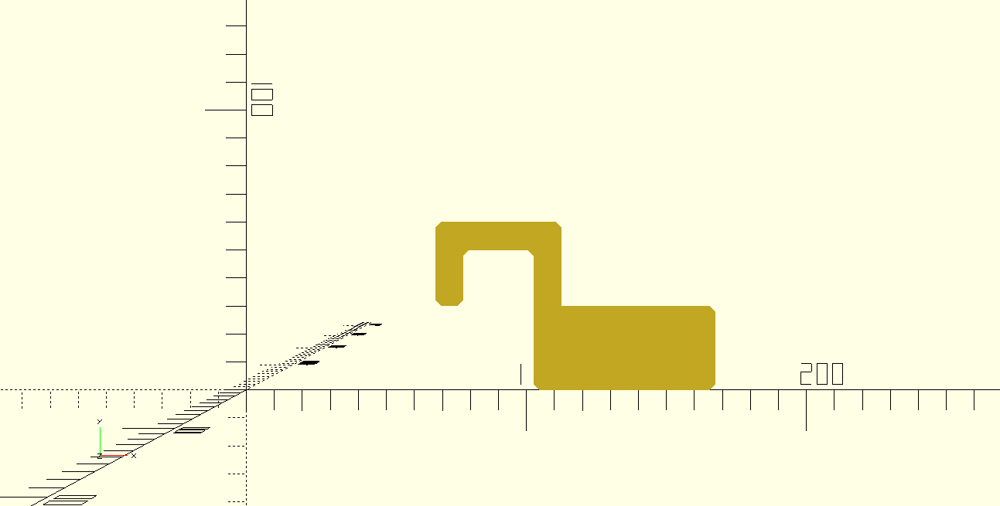
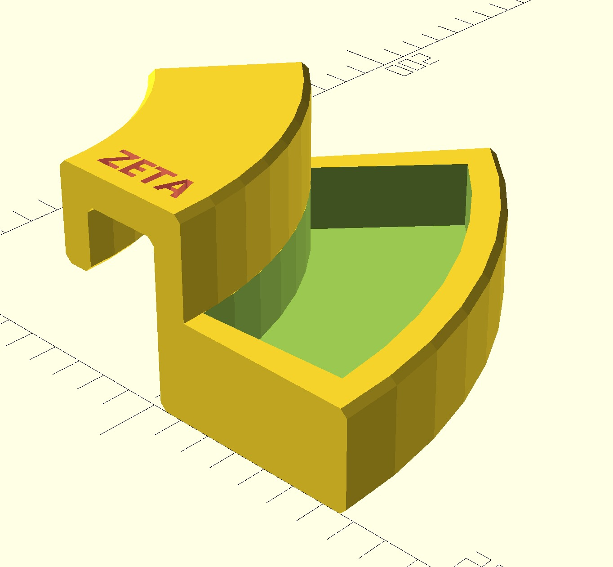
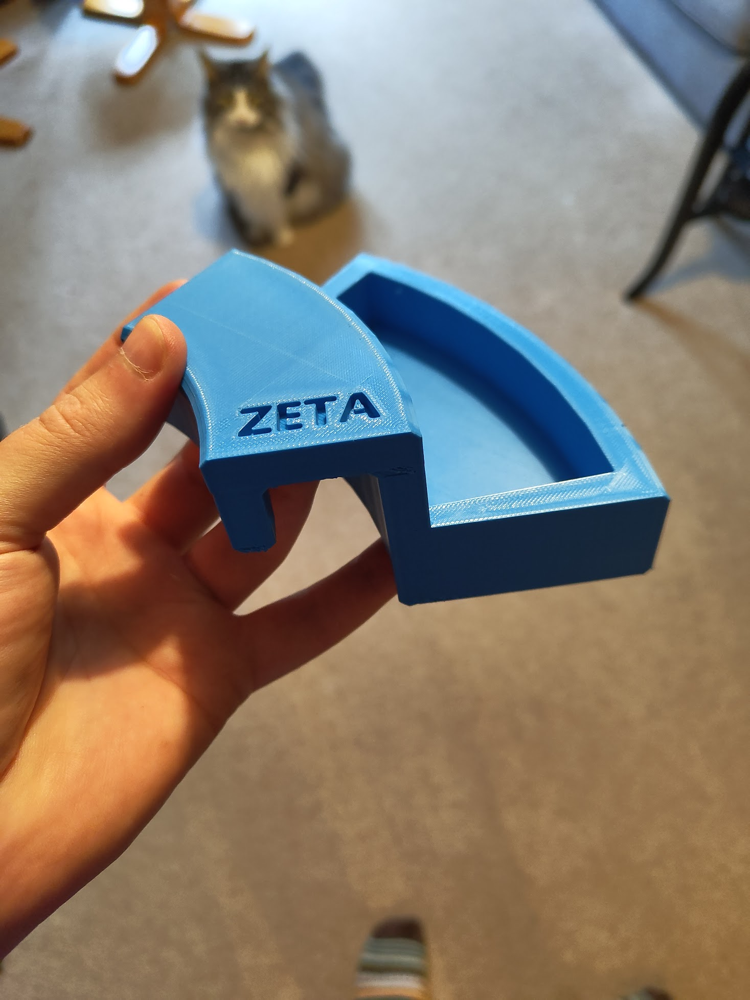
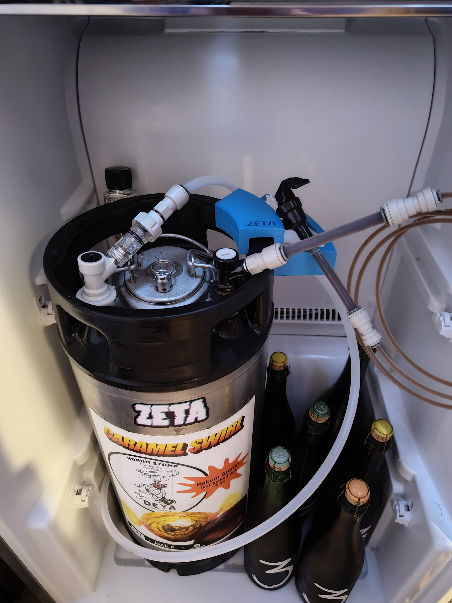
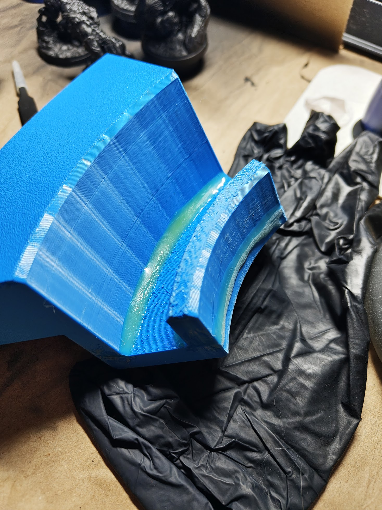

> [!NOTE]
> The below content is stale - The OpenSCAD file has since been changed to seperate the grip and accessories such that other items can be generated.

# Keg Drip Catcher

OpenSCAD design of a simple drip catcher for kegs like [these](https://www.themaltmiller.co.uk/product/new-aeb-19-litre-stainless-keg-tall-keg/).  
Should fit a kitchen sponge or paper towel in the tray.

- N.B. Maltmiller lists OD as 210mm, I measure 205mm.

## Overview

The below is the initial scratty drawing for me to work out the general shape and keep track of the profile.

```
 2  |IR-Th..OR+Th|  3
 ┌──────────────────┐
 │                  │
 │   ┌──────────┐   │
 │   │9        8│   │
 │   │ IR    OR │   │TrH+GrTh
 │   │          │   │
 │   │          │   │4                  5
 └───┘          │   └──────────────────┐
 1    10        │                      │
                │                      │
                │                      │SpongeTh
                │                      │
                └──────────────────────┘
               7                        6

    <-- - / + -->
```

This aspect is generated by `KegDripCatcherBody()` which is, unsurprisingly, the main body of the drip catcher.



### Parameter Effect

1. 1 .. 2 - `GripHeight` + `GripThickness`
1. 2 .. 3 - IR-`GripThickness` .. OR+`TrayThickness`
   - `OR` (outer radius) is derived from the `KegOD` (outer diameter.)
   - `IR` (inner radius) is calculated from `OR` - `KegRimThickness`
1. 3 .. 4 - `TrayHeight` + `GripThickness` - `SpongeThickness`
1. 4 .. 5 - `TrayThickness` + `SpongeDepth` + `TrayThickness` 
   - This parameter is not set correctly; Currently, it is not accounting for wall thicknesses,
   - ∴ `SpongeDepth` currently sets size of 8 .. 5,
   - `TrayOR` calculation *should* be updated to include 2x`TrayThickness`.
1. 5 .. 6 - `SpongeThickness` + `TrayThickness`
   - This parameter is not set correctly; Currently, it is not accounting for grip thickness,
   - ∴ `SpongeThickness` currently sets size of 5 .. 6 rather than the cutout,
   - `TrayOR` calculation *should* be updated to include 2x`TrayThickness`.
1. 6 .. 7 - Same issue as 4 .. 5
1. 7 .. 8 - Same issue as 5 .. 6
1. 8 .. 9 - OR .. IR
1. 9 .. 10 - `GripHeight`
1. 10 .. 1 - `GripThickness`

#### Sponge Cutout

`SpongeHolder()` defines a rectangle to use as the sponge cutout.

#### Render

The script produces a design like the following.



> [!ATTENTION]
> The steps in the angular repeat are caused by a low facet number, defined by private parameter `$fn`, increase this to something more suitable, like 360.

> [!TIP]
>Consider using `$fn = $preview ? 60 : 360;` in the future [as per docs](https://en.wikibooks.org/wiki/OpenSCAD_User_Manual/Other_Language_Features).

---

## 3D Print





### Post Processing

Due to the print orientation, I added some epoxy along the weakest points.



The print is still porous, so it is recommended to seal the resulting product. I used acrylic and varnish as they were to hand.


---

## Defects

1. Update `TrayOR` to correctly account for wall thicknesses.

--

## Improvements

1. Add tap retention for party taps,
1. Increase facet number (fn) for any future print,
1. Print in a different orientation for material strength,
1. Currently, the tray has an extreme angle to the keg which could be knocked; This *could* be tapered towards the keg instead.
